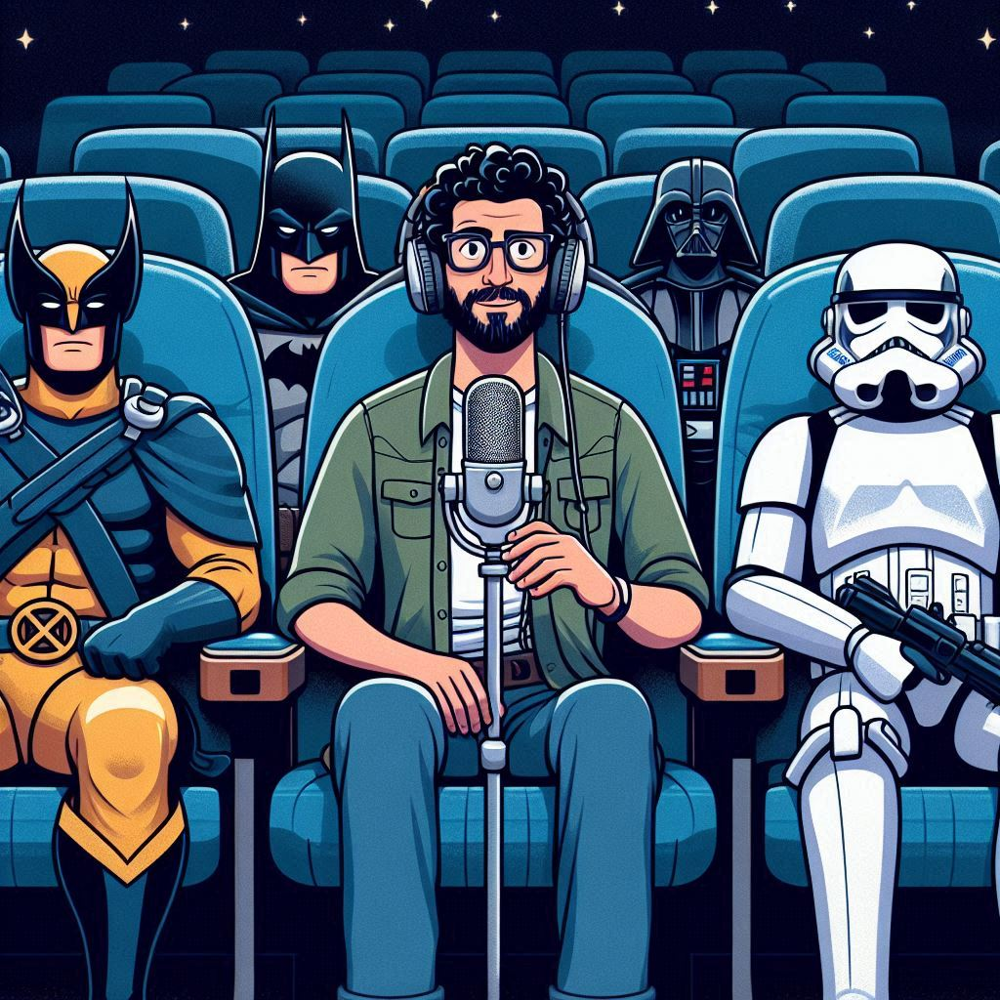

<https://github.com/TheRealminds/prompts-for-podcast-generate-by-ia/blob/main/output/PODCAST%20CASTONAUTAS.mp3>
    Preview do podcast

# Projeto Podcast Gerado por I.A.s

Projeto com o objetivo de gerar um podcast utilizando ferramentas de IA através de prompts mais trabalhados.

## 💻 Tecnologias utilizadas no projeto

- [ChatGPT](https://chat.openai.com/) 
- [Copilot](https://copilot.microsoft.com/)
- [Elevenlabs]
- [Capcut](https://www.capcut.com/pt-br/)

## ✨ Como foi feito?

- Roteiro gerado via ChatGPT
- Audio gerado pela Elevenlabs
- Copilot Para gerar capas
- Capcut para tratar aúdio e adicionar sons de fundo

## 📚 Materiais

- [Notion Template](https://www.notion.so/Criando-Podcast-com-IAS-Generativas-d22dc207f79e4f4988fbee5e729edbab?pvs=4)
- [Editor de aúdio](https://www.capcut.com/editor?from_page=landing_page&__action_from=picture_V%C3%ADdeos%20profissionais%20em%20minutos,%20n%C3%A3o%20em%20horas.)

## 🛠️ Instruções de execução

Utilize os prompts dentro do link do `Notion` fornecido na parte de `Materiais` para criar um podcast de maneira automatizada, para isso siga o passo a passo abaixo.

- 🤖 1. Use os prompts de roteiro no `ChatGPT`
- 🤖 2. Use os prompts de roteiro gerados pelo ChatGPT no `Elevenlabs`
- 🤖 3. Use os prompts de artes no `Copilot`

## 👩🏻‍💻 Expert

# Prompt via ChatGPT
Vou criar um podcast e preciso que me liste 10 sugestões de título. O podcast terá como principal inspiração bons papos sobre cinema, especialmente ficção científica. O título deve ser enxuto e interessante.

# Prompt via Copilot
Um Astronauta apresentador de podcast, sentado em uma poltrona confortável de cinema, estilo desenho animado x-men de 1997.
> O foco da imagem deve ser o apresentador;
> A imagem deve ter outros 4 personagens muito conhecidos do cinema: Wolverine, Darth Vader, Batman e Stormtrooper, sentados próximo ao apresentador;
> O apresentador tem cabelo cacheado preto, barba rala e usa óculos de grau
> imagem em formato paisagem
> microfone do podcast é acessório da roupa de astronauta

---
